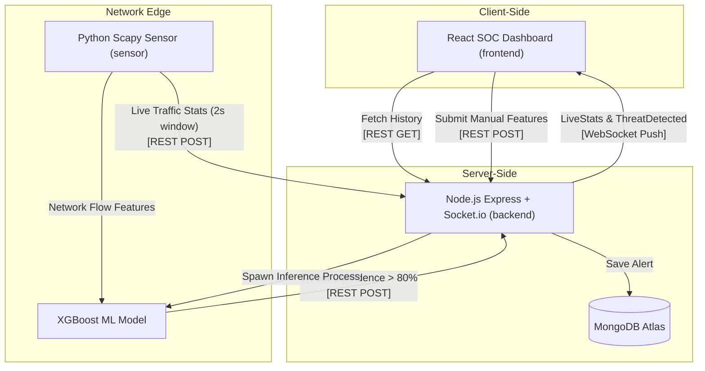

# 🛡️ Network Intrusion Detection System (NIDS) SOC Dashboard

<div align="center">

[](https://xgboost.readthedocs.io/)
[](/)
[](https://python.org)
[](https://nodejs.org)
[](https://react.dev)
[](https://docker.com)
[](https://mongodb.com/atlas)
[](LICENSE)

**A production-ready Machine Learning-driven Network Intrusion Detection System with real-time DDoS detection, live packet sniffing, an interactive SOC dashboard, and one-command Docker containerization.**

</div>

---

## 📋 Table of Contents

- [Executive Summary](#-executive-summary)
- [System Architecture](#-system-architecture)
- [Machine Learning Model](#-machine-learning-model)
- [Operating Modes](#-operating-modes)
- [Getting Started (Docker Deploy)](#-getting-started-docker-recommended)
- [Local Development Setup](#-local-development-setup-non-docker)
- [Live Demo Integration](#-live-demo-integration)
- [Detailed File Index](#-detailed-file-index)
- [API Reference](#-api-reference)
- [Environment Variables](#-environment-variables)

---

## 🚀 Executive Summary

This project implements a full-stack, enterprise-grade Security Operations Center (SOC) dashboard that monitors network traffic in real-time to detect anomalous and malicious activity, specifically Distributed Denial of Service (DDoS) attacks.

### Key Features

- 🧠 **99.85% Accurate ML:** Utilizes a highly optimized XGBoost Binary Classifier trained on the CIC-DDoS2019 dataset (evaluating **421,959** cleansed network flows — 327,391 malicious DDoS patterns and 94,568 benign samples).
- ⚡ **Real-Time Detection:** Employs a 2-second sliding window via Python's Scapy to capture live interface packets with near-zero latency.
- 🖥️ **Live SOC Dashboard:** A modern, responsive React 19 interface using WebSockets (Socket.io) to instantly push Threat Alerts and Live Analytics to the analyst's screen.
- 🔄 **Dual Operation Modes:** Run the sensor in Live Packet Sniffing (`real` mode) or generate synthetic ML flows for testing (`simulate` mode).
- 🗄️ **Persistent Threat Logging:** All detected threats are permanently hashed and logged to a MongoDB Atlas cluster, auto-trimmed to the latest 200 entries to preserve performance.
- 🐳 **Microservices Architecture:** Fully containerized via Docker-Compose for instant local deployment.

---

## 🏗️ System Architecture

The NIDS ecosystem is split into three highly decoupled microservices connected by a robust REST API and long-polling WebSockets.



### 🔐 Security & Authentication (`SENSOR_SECRET`)

To prevent unauthorized actors from submitting fake threats or performing Denial of Service (DoS) attacks on your backend, the system implements a strict machine-to-machine authentication mechanism using the `SENSOR_SECRET` environment variable.

- **The Sender (Python Sensor):** When the sensor detects a threat, it packages the `SENSOR_SECRET` into a custom HTTP header (`X-Sensor-Secret`) before sending the REST POST request.
  ```python
  # sensor/sensor.py
  SENSOR_SECRET = os.getenv("SENSOR_SECRET", "default_secret")
  
  headers = {
      "Content-Type": "application/json",
      "X-Sensor-Secret": SENSOR_SECRET
  }
  requests.post(url, json=alert_data, headers=headers)
  ```
- **The Receiver (Node.js Backend):** The backend acts as a gatekeeper. Before processing any incoming data, it verifies that the incoming `X-Sensor-Secret` header exactly matches its own `SENSOR_SECRET` environment variable. 
  ```javascript
  // backend/routes/alert.js
  const sensorSecret = req.headers['x-sensor-secret'];
  
  if (sensorSecret !== process.env.SENSOR_SECRET) {
    return res.status(401).json({ success: false, message: 'Unauthorized' });
  }
  // If matched, continue to save the alert to the database...
  ```
- **The Result:** If a hacker discovers your backend URL and attempts to inject fake data, they will lack the secret key. The backend immediately drops their request (returning `401 Unauthorized`), ensuring your database and dashboard remain secure and uncompromised.

---

## 🧠 Machine Learning Model

The core intelligence behind NIDS is a highly accurate Machine Learning classifier trained to recognize the flow signatures of different DDoS attack vectors.

- **Algorithm:** XGBoost Binary Classifier (`XGBClassifier`)
- **Dataset:** CIC-DDoS2019
- **Accuracy:** 99.85%
- **Threshold:** 80% baseline confidence interval for triggering a SOC Alert.
- **Classes:** `0` (BENIGN) and `1` (MALICIOUS/DDoS)

### The 15 Extracted Network Features

The Python sensor calculates these features locally before running inference to determine malicious probability.

1. `Flow Duration` (Total duration in μs)
2. `Flow Packets/s` (Transmission rate)
3. `Flow Bytes/s` (Bandwidth utilization)
4. `Flow IAT Mean` (Mean inter-arrival time in μs)
5. `Flow IAT Max` (Max inter-arrival time in μs)
6. `Flow IAT Std` (Std dev inter-arrival time)
7. `Fwd Packets/s` (Forward transmission rate)
8. `Bwd Packets/s` (Backward transmission rate)
9. `Fwd Packet Length Max` (Max forward payload)
10. `Fwd Packet Length Min` (Min forward payload)
11. `Fwd Packets Length Total` (Sum of forward payload)
12. `Packet Length Max` (Max overall packet size)
13. `Fwd Act Data Packets` (Forward payloads > 0)
14. `Total Backward Packets` (Count of return packets)
15. `ACK Flag Count` (TCP ACK presence, dynamically encoded)

---

## 🎯 Operating Modes

The Python Sensor runs in two completely separate states depending on your environment capabilities. You assign this via the `--mode` flag.

### 🟢 Simulate Mode (Default / Docker Safe)

Best for CI/CD, demonstrations, and Docker deployments without network host access.

- **Mechanism:** Procedurally generates synthetic 15-feature network flows every 2 seconds. Injects malicious vectors automatically every 90-120 seconds.
- **Requirements:** None. Completely safe.
- **ML Engine:** Feeds synthetic vectors directly to the actual XGBoost `.pkl` model.

### 🔴 Real Mode (Live Packet Sniffing)

Best for production deployment on network boundaries, NGINX servers, or personal testing.

- **Mechanism:** Binds Scapy socket to an explicit Network Interface Card (NIC) and captures actual TCP/UDP/ICMP traffic leaving and entering your machine.
- **Requirements:** Requires explicit OS Administrator/Root privileges (e.g., `sudo`). Requires accurate `.env` configuration of your `MY_IP` and `INTERFACE`.
- **ML Engine:** Parses real captured bytes into ML vectors and evaluates authentic traffic.

---

## 🐳 Getting Started (Docker / Recommended)

Deploying the entire NIDS tech stack takes less than one command.

### Dependencies

- Docker Desktop (Windows/Mac) or Docker Engine (Linux).
- A free-tier [MongoDB Atlas](https://www.mongodb.com/atlas) Cluster URI.

### Step 1: Environment Setup

Clone the repository and create the master `.env` file in the **root** folder.

```bash
git clone https://github.com/your-repo/NIDS_ML.git
cd NIDS_ML
```

Create exactly this file (`.env`):

```ini
# --- ROOT .ENV ---
MONGO_URI=mongodb+srv://<admin>:<password>@<cluster>.mongodb.net/NIDS
SENSOR_SECRET=super_secret_auth_key_123

# IF YOU INTEND TO CHANGE `docker-compose.yml` TO USE REAL MODE:
MY_IP=192.168.1.100
INTERFACE=Wi-Fi
```

> **How to find your IP and Interface Name:**
>
> - **Windows:** Open Cmd/PowerShell and run `ipconfig`. Look for "IPv4 Address" and the adapter name (e.g., `Wi-Fi` or `Ethernet`).
> - **Linux:** Run `ip addr` or `ifconfig`. Look for `inet` and the interface name (e.g., `eth0` or `wlan0`).
> - **Mac:** Run `ifconfig`. Look for `en0` or `en1`.

### Step 2: Build and Deploy

```bash
docker-compose up --build -d
```

_Note: The first build will take ~3-8 minutes as Docker correctly compiles `libgomp1` and builds the `XGBoost` C++ backend inside the Debian container._

### Step 3: Access the SOC

- **Live React Dashboard:** http://localhost:5173
- **Node API:** http://localhost:3000
- **Stop Containers:** `docker-compose down`

---

## 🌍 Production Integration (e.g., E-Commerce)

One of the most powerful aspects of this architecture is how effortlessly it can be integrated into a real-world application, such as an e-commerce website, to proactively block DDoS attacks or bad actors.

### How to Integrate NIDS into your Website

1. **Deploy the Sensor:** Run the Python sensor on your active web server, reverse proxy, or load balancer (for example, your NGINX or Apache server).
2. **Monitor the Edge Interface:** Set the sensor's `.env` configuration to listen to your public-facing network interface (e.g., `eth0`).
3. **Trigger Automated Defense Mechanisms:** When the machine learning model flags a severe anomaly, you can configure the sensor to automatically trigger firewall rules to drop the malicious traffic instantly, keeping your site online.

### Architecture Example: Automated Blocking

You can easily modify the `predict_and_alert` function within `sensor/sensor.py` to trigger a system firewall tool (like `iptables`) the moment a threat is detected.

```python
import subprocess

def predict_and_alert(source_ip, probability):
    # If XGBoost prediction confidence exceeds 80%
    if probability >= 80.0:
        # 1. Alert the SOC Dashboard
        send_alert(source_ip, probability)

        # 2. AUTOMATICALLY BLOCK the attacker's IP at the OS Firewall
        print(f"🧱 Blocking IP {source_ip} via iptables...")
        subprocess.run(["sudo", "iptables", "-A", "INPUT", "-s", source_ip, "-j", "DROP"])
```

_Note: For cloud architectures (AWS, Azure, Cloudflare), you can swap the `iptables` OS command with a simple HTTP request to your Cloud Provider's Web Application Firewall (WAF) API to ban the IP at the network edge._

---

## 💻 Local Development Setup (Non-Docker)

If you want to modify code without rebuilding containers, run all three services locally on your machine network. You will need Node.js 20+ and Python 3.11+.

### 1. Backend (Node.js API)

```bash
cd backend
npm install
# Ensure you copy .env.example to .env and fill in MONGO_URI
npm run dev
# Server will start on Port 3000
```

### 2. Frontend (React SOC)

```bash
cd frontend
npm install
npm run dev
# Dashboard available on Port 5173
```

### 3. Sensor (Python Sniffer)

```bash
cd sensor
python -m venv .venv

# Windows activation:
.venv\Scripts\activate
# Mac/Linux activation:
source .venv/bin/activate

pip install -r requirements.txt
# Ensure you copy .env.example to .env

# Run safely in simulator mode:
python sensor.py --mode simulate

# OR run in live root mode (must be Admin/root!):
python sensor.py --mode real
```

---

## 🎬 Live Demo Integration

The dashboard features a **"🎬 Demo"** button on the top right navigation bar. This uses an embedded YouTube iframe modal overlay allowing users to see a pre-recorded demonstration of the NIDS successfully capturing real network DDoS floods without leaving the SPA (Single Page Application).

**To configure your demo video:**

1. Upload your presentation video to YouTube and set it to **Unlisted**.
2. Grab the 11-character Video ID from the link (e.g., `https://youtu.be/dQw4w9WgXcQ` -> `dQw4w9WgXcQ`).
3. Open `frontend/src/components/DemoVideoModal.jsx`.
4. Locate `const YOUTUBE_VIDEO_ID = "YOUR_YOUTUBE_ID_HERE"`.
5. Paste your ID. The modal will now securely stream the YouTube asset using high-performance `iframe` autoplay logic.

---

## 📁 Detailed File Index

An exhaustive breakdown of the project architecture and what each specific file does:

### ⚙️ Root Configuration

- `docker-compose.yml` - Multi-service orchestrator. Networks `nids-frontend`, `nids-backend`, and `nids-sensor` together on an internal Docker bridge. Controls environment injection.
- `.gitignore` - Centralized file keeping `node_modules`, standard `.env` secrets, and Python `__pycache__` out of version control.
- `README.md` - (This file) Complete technical documentation and deployment guide.

### 🌐 Frontend (`/frontend`) HTML/JS/CSS logic built with Vite & React 19.

- `Dockerfile.frontend` - Multi-stage build pulling `node:20-alpine`. Bakes `VITE_API_URL` during `npm run build` and runs a static HTTP server.
- `package.json` - Declares React UI dependencies (`framer-motion`, `axios`, `recharts`, `socket.io-client`).
- `vite.config.js` - Configuration for the Vite bundler (enables Tailwind processing and React plugins).
- `index.html` - Base HTML document; contains the custom `🛡️` inline SVG Favicon and DOM mount point.
- **`src/App.jsx`** - **The master React component.** Manages WebSocket state, handles the layout grid, and controls the visibility of modals/overlays.
- **`src/hooks/useSocket.js`** - **Crucial WebSocket logic.** Establishes the real-time `Socket.io` connection to the Node backend. Listens for `LiveStats` and `ThreatDetected` broadcasts and feeds them natively into React State arrays.
- **`src/components/`**
  - `Header.jsx` - Top navigation bar containing the real-time ping indicator, the Demo button, and Manual Input action.
  - `TrafficGraph.jsx` - Renders an animated `recharts` AreaChart charting packets per second.
  - `ThreatChart.jsx` - Renders a LineChart showing ML confidence thresholds for detected intrusions.
  - `ThreatTable.jsx` - Formats the historical MongoDB alert data into a scannable, color-coded tabular format (🔴 DDoS, 🟣 Manual-Test).
  - `SensorLog.jsx` & `BackendLog.jsx` - Live terminal emulators scrolling local activity from the Python and Node instances respectively.
  - `ManualInputModal.jsx` - Interactive form allowing Security Analysts to type out 15 exact network features to test the XGBoost engine manually.
  - `DemoVideoModal.jsx` - Optimized overlay modal rendering the YouTube iframe to show the project operating in real-mode natively.

### 🧮 Backend (`/backend`) Node.js REST API + WebSocket Server

- `Dockerfile.backend` - Uses `node:20-slim`. Incredibly complex build that explicitly installs `python3`, `xgboost`, `pandas`, and `libgomp1` dependencies native to the debian kernel so the Node server can spawn python processes.
- `package.json` - Requires `express`, `mongoose`, `socket.io`, `cors`, and `dotenv`.
- **`server.js`** - Instantiates the Express HTTP server, establishes the Socket.io WSS mapping, binds to MongoDB via Mongoose, and attaches the router modules.
- **`routes/alert.js`** - **The operational brain of the API.**
  - `POST /internal/stats` - Parses 2s window payloads from the sensor and pushes them to WebSockets.
  - `POST /internal/alert` - Parses +80% confidence ML detections, saves to Mongo, pushes to WebSockets.
  - `POST /predict/manual` - Executes the `predict_manual.py` subprocess, passing in JSON objects to evaluate manual queries.
  - Controls database auto-trimming to 200 documents.
- `models/Alert.js` - Mongoose Schema. Enforces data typing for `source_ip`, `probability`, `threat_type`, and the 15 `features` JSON array.

### 🐍 Sensor (`/sensor`) Core Machine Learning Sniffer

- `Dockerfile.sensor` - Runs `python:3.11-slim`, installs `pcap` C-libraries for system-level networking, and runs `sensor.py` as a detached daemon.
- `requirements.txt` - Dictates Python pip limits (`scapy`, `xgboost`, `pandas`, `requests`).
- **`sensor.py`** - **The core intelligence.** Contains the `PacketFlow` memory objects, binds to the NIC interface (Real Mode) or schedules synthetic drops (Simulate Mode). Evaluates packets every 2,000ms using a multiprocessing thread. Dispatches POST requests safely to the Backend via standard `urllib/requests`.
- `predict_manual.py` - Single-execution script called exclusively by Node.js. Loads the XGBoost `.pkl` and evaluates a specific JSON `sys.argv` payload from an analyst.
- `interface.txt` - Optional helper text detailing OS-specific ways of discovering network interface names on Windows (`ipconfig`) vs Linux (`ifconfig`).

### 📖 Machine Learning Pipeline (`/ml`)

- `NIDS.ipynb` - The original Jupyter Notebook Data Science workflow. Documents how the CIC-DDoS2019 dataset was loaded, cleaned, how features were pruned from 86 to 15, and how the XGBoost pipeline was trained.
- `requirements.txt` - Heavy requirements for notebook usage (`matplotlib`, `seaborn`, `jupyter`).
- **`model/`**
  - `nids_model.pkl` - The serialized binary XGBoost model (highly compressed byte array).
  - `nids_encoder.pkl` - Serialized One-Hot-Encoder utilized specifically for translating the Boolean `ACK Flag Count` into standardized ML binary arrays.
  - `nids_metadata.json` - Hardcoded feature ordering strictly enforcing the index array positions expected by XGBoost during prediction inference.

---

## 📡 API Reference

### Internal Traffic (Secured)

Require header `X-Sensor-Secret` to match `.env`.
| Method | Route | Description |
|---|---|---|
| `POST` | `/api/internal/stats` | Sensor posts live traffic window analytics. |
| `POST` | `/api/internal/alert` | Sensor posts verified > 80% Threat Vectors. |

### Public Endpoints (Dashboard)

| Method | Route                      | Description                                      |
| ------ | -------------------------- | ------------------------------------------------ |
| `GET`  | `/api/alerts`              | Fetches the latest 50 alerts from MongoDB Atlas. |
| `POST` | `/api/predict/manual`      | Spawns python process to evaluate {features}.    |
| `POST` | `/api/test/trigger-attack` | Debug endpoint to inject artificial DDoS logs.   |

### WebSockets (Socket.io)

Client exclusively listens for `on()` events.

- `ThreatDetected` - Pushed the millisecond an alert is saved to the DB. Triggers the top UI banner and UI charts.
- `LiveStats` - Pushed every 2000ms directly connecting the sensor's pcap captures visually to the React Dashboard.

---

## 🔧 Environment Variables

### Root Repository (`/.env`)

Must be adjacent to `docker-compose.yml`.

```ini
MONGO_URI=your_atlas_connection_string
SENSOR_SECRET=a_random_secure_password
MY_IP=192.168.1.5 (Used exclusively for Real Mode packet filtering)
INTERFACE=eth0 (Used exclusively for Real Mode interface binding)
```

### Specific Services (`/backend/.env` & `/sensor/.env`)

These are automatically injected if passing variables via Docker Compose, but are explicitly required if running components manually via raw Terminal/Command Prompt.

- **Backend:** requires `MONGO_URI`, `SENSOR_SECRET`, and `CLIENT_URL` (usually `http://localhost:5173` to whitelist CORS headers).
- **Sensor:** requires `BACKEND_URL` (usually `http://localhost:3000`), `SENSOR_SECRET`, `INTERFACE`, and `MY_IP`.

---

_Created and optimized for enterprise local-host security monitoring._
